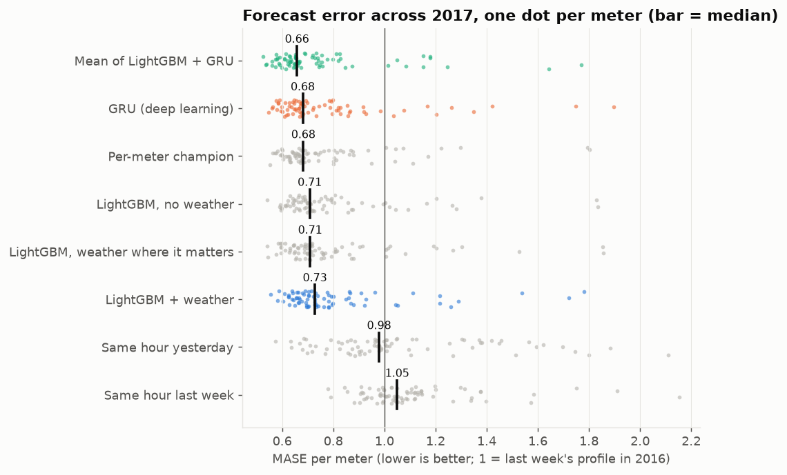
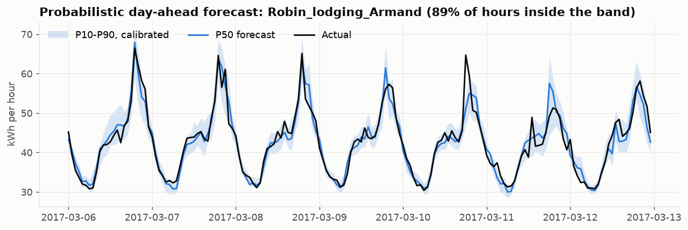
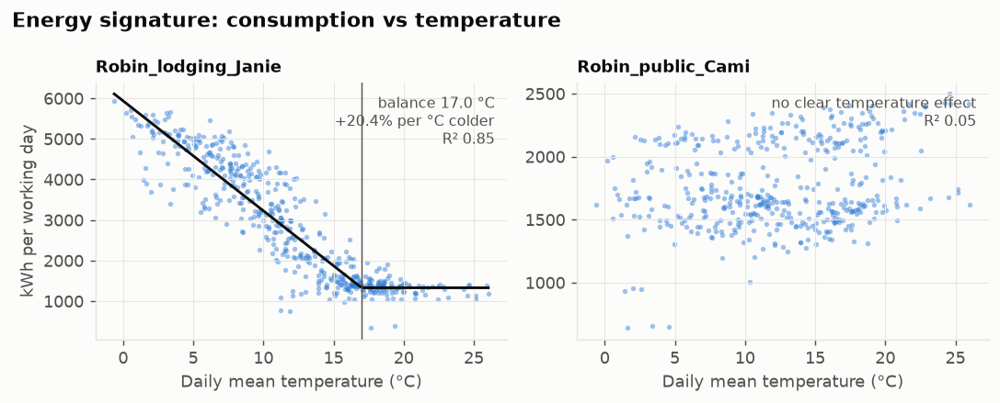
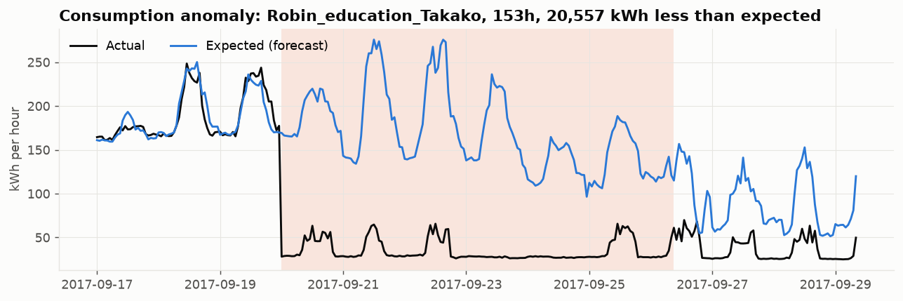

# Meter-level energy forecasting & anomaly detection · Databricks + Dataiku

Day-ahead hourly electricity forecasts for **76 building meters** (two university campuses,
London and Dublin, 2016–2017, 1.5 M readings from the
[Building Data Genome Project 2](https://github.com/buds-lab/building-data-genome-project-2)),
cross-referenced with weather, with automatic detection of **meter faults** and
**consumption anomalies**.

Data engineering runs on **Databricks** (PySpark, Delta, bronze/silver/gold, scheduled job).
Modelling, evaluation, monitoring and the stakeholder dashboard run in **Dataiku**
(Flow, Visual ML, Python recipes, scenario with a quality gate, wiki).

> Résumé en français pour un public non technique : [`docs/synthese_fr.md`](docs/synthese_fr.md)

## Results (rolling-origin backtest, 12 monthly retrains over 2017)

| Model | Median MASE | Median sMAPE | Total MAE vs seasonal naive |
|---|---|---|---|
| **Mean of LightGBM + GRU** (ensemble) | **0.66** | **11.1 %** | **−35 %** |
| GRU sequence model (deep learning, PyTorch) | 0.68 | 11.2 % | −32 % |
| Per-meter champion (online selection LightGBM/GRU) | 0.68 | 11.2 % | −32 % |
| LightGBM, no weather | 0.71 | 11.9 % | −30 % |
| LightGBM, weather only where the 2016 signature says it matters | 0.71 | 11.8 % | −30 % |
| LightGBM + weather (all meters) | 0.73 | 12.1 % | −29 % |
| Same hour yesterday | 0.98 | 14.8 % | −5 % |
| Same hour last week (seasonal naive) | 1.05 | 15.9 % | reference |

- **Is the gain real?** Diebold-Mariano test per meter on daily losses (HAC variance), with
  Benjamini-Hochberg correction across the 76 meters: LightGBM beats the seasonal-naive baseline on
  **71 / 76 meters** (FDR 5 %) and is worse on none.
- **Deep learning vs gradient boosting, and why the ensemble wins:** the GRU alone is significantly
  better than LightGBM on 21 meters but *worse* on 7, so it isn't a clean upgrade. Their plain
  average is: **−7.5 % MAE vs LightGBM, significantly better on 63 / 76 meters and worse on none**;
  better than the GRU on 36 and worse on none. The two models make different errors (lag/calendar
  trees vs a learned 7-day sequence), and averaging cancels part of them. Picking the best model per
  meter from past months (online selection, no test leakage) did *worse* than averaging: month-to-month
  winners are noisy, so selection chases noise. **Recommended production model: the mean ensemble.**
- **Does weather help?** Barely, for these buildings at this horizon. Adding weather to every meter
  makes LightGBM *worse* on 11 meters and better on none. Only 7 / 76 meters show a clear temperature
  relationship (energy signature R² > 0.5; median R² = 0.05), because these campuses heat with gas.
  Restricting weather to the 11 meters that looked weather-driven *in 2016* fixes the damage
  (significantly better than weather-everywhere on 16 meters, worse on none), but is only on par
  with no weather at all (7 better, 5 worse). For the electrically heated buildings, load rises
  up to **20 % per °C colder** below a ~17 °C balance point. With electric heating *and*
  air-conditioning, as in Monaco, the result would likely flip.
- **Probabilistic forecasts:** quantile LightGBM's P10–P90 band covers only **73.7 %** of outcomes
  instead of 80 % (overconfident). A per-meter split-conformal correction, calibrated on the 4 weeks
  before each month, brings it to **79.3 %** (Robin 79.8 %, Wolf 78.8 %; monthly range 75–85 %).
  The band is then useful for energy purchasing: "tomorrow 14:00, 80 % chance between X and Y kWh".
- **Meter faults:** 6.4 % of readings flagged in silver (stuck registers, zero dropouts, isolated
  spikes), grouped into 919 fault events, 12 meters excluded from modelling (< 85 % valid hours).
- **Consumption anomalies:** 2,253 residual-based events, of which **1,555 are site-wide** (many
  buildings deviating on the same day: the Dec 2017 snowfall, Saturdays run like weekdays, closure
  days) → calendar/weather causes, not building issues. That leaves **258 building-specific
  priority events on 36 meters** (each ≥ 20 % of a normal day's energy), ranked for follow-up.

<p align="center"></p>
<p align="center"></p>
<p align="center"></p>
<p align="center"></p>

*Above: a step change on 20 Sep 2017. Load drops to a third and stays there. Either a sub-meter
was re-wired or part of the building was closed. Exactly the kind of event to send to the site team.*

## Architecture

```
            Databricks (PySpark · Delta · Unity Catalog)                      Dataiku
 ┌──────────────────────────────────────────────────────────────┐   ┌──────────────────────────────┐
 │ raw CSV (Volume)                                             │   │ Prepare → Split              │
 │   └─ 01 bronze_meters   wide → long, 1.5 M rows              │   │ Visual ML (LightGBM/RF/Ridge)│
 │   └─ 02 silver_meters   hourly grid · quality flags ·        │──▶│ Score → Evaluate (MES)       │
 │        silver_weather   ≤3h interpolation · DQ asserts       │   │ Python: backtest · DM tests  │
 │   └─ 03 gold_features   lags ≥24h · degree-days · calendar   │   │ Python: faults · anomalies   │
 │   └─ 04 EDA · energy signatures                              │   │ Scenario: monthly retrain +  │
 │ Job (databricks.yml): nightly bronze → silver → gold         │   │   quality gate · Dashboard   │
 └──────────────────────────────────────────────────────────────┘   └──────────────────────────────┘
                  shared Python package  src/energyfc  (tested, used by both platforms)
```

## Design decisions

| Decision | Why |
|---|---|
| Forecast issued at midnight for all 24h of the next day; every load feature lagged ≥ 24h | Matches how a day-ahead forecast is used; no feature that would be unavailable in production |
| Complete hourly grid before any lag | `lag(24)` is only "same hour yesterday" if no hour is missing |
| Spark session in UTC | BDG2 timestamps are local wall-clock; a DST-aware zone adds/drops an hour twice a year |
| Spikes = isolated jumps vs both neighbours **and** outside the meter's 1–99 % range | A global outlier rule flagged real daily peaks on school buildings (found and fixed, see tests) |
| One global model (LightGBM and GRU), target scaled by each meter's 2016 mean | Small noisy meters borrow strength from similar buildings; scale uses history only (no leakage) |
| Interpolated hours used as inputs, never scored | Metrics measure the forecast against real readings only |
| Rolling-origin backtest with monthly refits | Mirrors the production retraining schedule, instead of one lucky split |
| DM test on **daily** losses + HAC + BH correction | Hourly errors within one day share the same forecast run; testing 76 meters at 5 % would give ~4 false wins by chance |
| MASE as headline metric | Scale-free across meters of 5 to 600 kWh/h; 1.0 = "last week's profile" |
| Faults and anomalies kept separate | Different owners: metering team vs energy manager |
| Ensemble = plain average, no fitted weights | Nothing tuned on the test months; weights fitted on 12 months of noisy wins would overfit |
| Weather gating decided on 2016 signatures only | Choosing "sensitive" meters with 2017 data would leak test information into the model |
| Conformal calibration per meter, on the 4 weeks before each month | Coverage guarantee without retraining; one pooled margin under-covered the noisier Dublin site |

## Repository

```
src/energyfc/          shared package
  cleaning.py          bronze → silver (PySpark): grid, quality flags, interpolation
  features.py          silver → gold (PySpark): lags, weather, calendar, scaling
  backtest.py          rolling-origin backtest, baselines, LightGBM, quantiles + conformal, scoring
  stats_tests.py       Diebold-Mariano (HAC + HLN), Benjamini-Hochberg
  anomalies.py         meter faults, residual anomalies, site-wide vs building-specific
  signature.py         change-point energy signature (balance temperature, heating slope)
  deep.py              GRU day-ahead challenger (PyTorch), same backtest protocol
  ensembles.py         mean ensemble, online per-meter champion selection
databricks/            00–05 notebooks (source format) · databricks.yml = scheduled job
dataiku/               FLOW_GUIDE.md (how the project is built) · recipes/ · WIKI.md · project_lib/
scripts/               run_pipeline_local.py · run_evaluation.py · run_notebooks_local.py
                       export_for_dataiku.py · run_dataiku_recipes_local.py · package_dataiku_lib.py
tests/                 Spark tests for each cleaning rule, stats tests, GRU leakage test,
                       dataiku_stub/ (stand-in for the Dataiku API to run recipes locally)
docs/                  figures · synthese_fr.md
.github/workflows/     CI: ruff + pytest (incl. Spark tests on Java 17) on every push
```

## Running it

**Databricks** (Free Edition works): *Workspace → Create → Git folder* with this repo, run
`databricks/00_setup` → `01` → `02` → `03` → `04`, or deploy the job:
`databricks bundle deploy -t dev`. Hand-off to Dataiku: `05_export_for_dataiku`, or point a
Dataiku Databricks connection at `workspace.energy.gold_features`.

**Dataiku** (built and run on Dataiku DSS 15.0.2, Free Edition): import
[`dataiku/export/ENERGY_FORECAST.zip`](dataiku/export/ENERGY_FORECAST.zip) (*+ New project → Import*),
upload the four CSVs from `scripts/export_for_dataiku.py`, then build the Flow. Or rebuild the whole
project from scratch against any DSS instance with the API:

```bash
export DSS_URL=http://localhost:11000 DSS_API_KEY=...       # an admin API key
python scripts/export_for_dataiku.py
python scripts/build_dataiku_project.py --recreate          # setup → flow → ml → run → ops → dashboard → export
```

The project contains: 3 Flow zones; Prepare + Split visual recipes; 7 Python recipes (backtest, GRU,
ensemble, DM tests, conformal intervals, anomalies, chart publishing) using the `energyfc` project
library and a dedicated code env; a Visual ML task (LightGBM vs Ridge, explicit 2016/2017 split)
deployed as the saved model `load_forecast`, with Score and Evaluate recipes feeding a Model
Evaluation Store; data-quality rules on `gold_features`; the scenario *Monthly retrain* (DQ rules →
retrain → rebuild outputs → Python quality gate); a 3-page dashboard; and the handover wiki.
[`dataiku/FLOW_GUIDE.md`](dataiku/FLOW_GUIDE.md) documents each step for building it by hand.

**Verified run in Dataiku** (whole Flow executed inside DSS, then one full retrain cycle with
`--stages retrain`): median MASE ens_mean 0.658 · GRU 0.680 · LightGBM 0.727 · seasonal naive 1.050,
calibrated P10–P90 coverage 79.2 %, all 4 data-quality rules OK, quality gate passed, 2 evaluations in
the Model Evaluation Store. Visual ML (explicit 2016 → 2017 split): LightGBM MAE 0.132 / R² 0.65 vs
Ridge 0.159 / 0.58 (normalised load). DM win counts differ by a few meters from the local run
(e.g. ensemble vs LightGBM 60 vs 63), from different LightGBM/PyTorch builds; conclusions are unchanged.

**Locally** (same Spark code, parquet instead of Delta; needs Java 17):
```bash
pip install -r requirements.txt && pip install -e .
python scripts/run_pipeline_local.py   # ~3 min, writes data/local/{bronze,silver,gold}
python scripts/run_evaluation.py       # backtest + DM tests + figures (+ ~30 min GRU, cached; --no-gru to skip)
python scripts/run_notebooks_local.py  # executes Databricks notebooks 01-04 as written, dbutils stubbed
python scripts/export_for_dataiku.py && python scripts/run_dataiku_recipes_local.py
pytest
```
On macOS LightGBM also needs the OpenMP runtime (`brew install libomp`).
Raw data: download `electricity.csv` (meters/raw), `weather.csv`, `metadata.csv` from BDG2 into `data/raw/`.

## Limitations and next steps

1. **Observed weather stands in for a weather forecast**, so accuracy with real forecasts will be
   slightly lower. Next: Météo-France / ECMWF day-ahead forecasts.
2. **Institutional calendar** (term dates, exam Saturdays, closure days) as a feature: it explains
   most site-wide anomaly days.
3. Anomaly detection still uses LightGBM residuals; switching it to the ensemble would tighten
   the expected-consumption baseline.
4. A recurring 05:00 start-up surge on one building is flagged as a spike: thresholds should be
   confirmed with the metering team.
5. Dataiku Free Edition has no time-based scenario triggers, so *Monthly retrain* is run on demand
   (or from the Databricks job via the API); on a licensed instance, add the monthly trigger.
